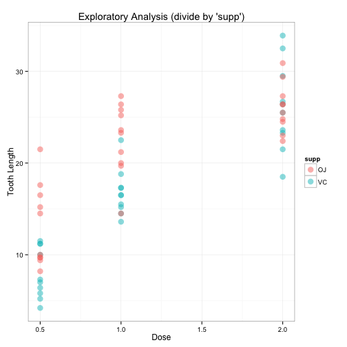
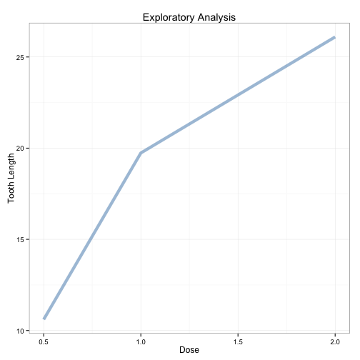

# Overview
Analysis of the ToothGrowth data from the R datasets package, as part of the Statistical Inference course from Coursera.

# Required tools
Loading the required libraries.


```
## 
## Attaching package: 'dplyr'
## 
## The following object is masked from 'package:stats':
## 
##     filter
## 
## The following objects are masked from 'package:base':
## 
##     intersect, setdiff, setequal, union
```

# Exploratory Data Analysis

## Overall analysis, by dose and supplement
 

*Note: See appendix for generating code required for this figure.*

From the plot above, it seems the 'supp' (Supplement Type) doesn't impact the tooth growth although as the dosage increases, there seems to be a clear increase in tooth growth.  Let's perform an exploratory analysis of the data by doses only.

## Analysis, by dose only


```r
# Summarise the data by dose and average changes of teeth
data_bydose <- data %>%
  group_by(dose) %>%
  summarise(AVG = mean(len))
```

 

*Note: See appendix for generating code required for this figure.*

From the latest plot, it seems clearer that as the dose increases, the tooth length changes increase.

## Summary of the data

```r
# Basic summary of the data
summary(data)
```

```
##       len        supp         dose      
##  Min.   : 4.20   OJ:30   Min.   :0.500  
##  1st Qu.:13.07   VC:30   1st Qu.:0.500  
##  Median :19.25           Median :1.000  
##  Mean   :18.81           Mean   :1.167  
##  3rd Qu.:25.27           3rd Qu.:2.000  
##  Max.   :33.90           Max.   :2.000
```

# Confidence Intervals and Hypothesis Tests

## Assumptions
1. 'len' is a continuous random variable, hence using a T distribution (as a better alternative to a normal distribution) 
2. The observations are unrelated and independent (hence, using the "Independent T Confidence Intervals")
3. Assuming a different variance per group.

## Condidence Intervals

```r
# Testing dose
t.test(data$len, data$dose, paired=FALSE, var.equal=FALSE)
```

```
## 
## 	Welch Two Sample t-test
## 
## data:  data$len and data$dose
## t = 17.81, df = 59.798, p-value < 2.2e-16
## alternative hypothesis: true difference in means is not equal to 0
## 95 percent confidence interval:
##  15.66453 19.62881
## sample estimates:
## mean of x mean of y 
## 18.813333  1.166667
```

```r
# Testing supp
t.test(data$len ~ data$supp)
```

```
## 
## 	Welch Two Sample t-test
## 
## data:  data$len by data$supp
## t = 1.9153, df = 55.309, p-value = 0.06063
## alternative hypothesis: true difference in means is not equal to 0
## 95 percent confidence interval:
##  -0.1710156  7.5710156
## sample estimates:
## mean in group OJ mean in group VC 
##         20.66333         16.96333
```

## Conclusions
1. Strong relation as the dose increases, the changes to the tooth growth increase.  Since the entire interval has positively shifted, hence rejecting the null hypothesis and confirming the impacts from the dose size to the tooth growth.
2. Since 0 is contained within the interval, no conclusions can be made related to the supplement type, hence no relation can be made between the changes in tooth growth and the supplement type.

\pagebreak

# Appendix

## Figure 1

```r
# Plot the length changes by the dose and type of supplement
ggplot(data, aes(dose, len)) +
  geom_point(aes(color = supp), size=4, alpha=1/2) +
  xlab("Dose") +
  ylab("Tooth Length") +
  labs(title="Exploratory Analysis (divide by 'supp)") +
  theme_bw()
```

## Figure 2

```r
# Plot the length changes by the dose only
ggplot(data_bydose, aes(dose, AVG)) +
  geom_line(color="steelblue", size=2, alpha=1/2) +
  xlab("Dose") +
  ylab("Tooth Length") +
  labs(title="Exploratory Analysis") +
  theme_bw()
```

